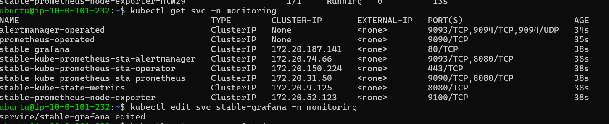
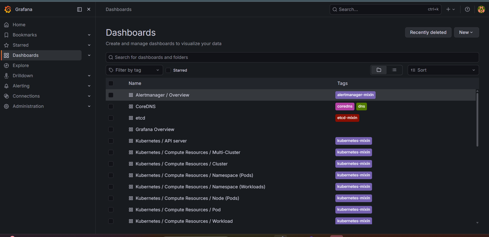
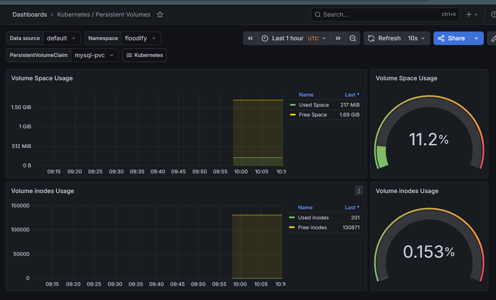

# Monitoring AWS EKS Using Grafana and Prometheus

## Prerequisites

* AWS Account
* Ubuntu EC2 Instance
* EKS
* Helm Charts
* Grafana
* Prometheus


## Install Helm

```bash
curl https://raw.githubusercontent.com/helm/helm/main/scripts/get-helm-3 | bash
```

Verify:

```bash
helm version
```

Expected Output:

```bash
version.BuildInfo{Version:"v3.x.x"...}
```

---

```


Verify namespaces:

```bash
kubectl get ns
```
---

# Step 8: Add Helm Repositories

Add Stable Charts Repository:

```bash
helm repo add stable https://charts.helm.sh/stable
```

Add Prometheus Community Repository:

```bash
helm repo add prometheus-community https://prometheus-community.github.io/helm-charts
```

Update Helm repositories:

```bash
helm repo update
```

---

# Step 9: Create Monitoring Namespace

```bash
kubectl create namespace monitoring
```

Verify:

```bash
kubectl get ns
```

---

# Step 10: Install Prometheus and Grafana

Install kube-prometheus-stack using Helm:

```bash
helm install stable prometheus-community/kube-prometheus-stack --namespace monitoring
```

Verify pods:

```bash
kubectl get pods -n monitoring
```

Wait until all pods are in `Running` state.


---

# Step 11: Expose Prometheus Using LoadBalancer

Check services:

```bash
kubectl get svc -n monitoring
```
---

# Step 13: Expose Grafana Using LoadBalancer

Check services:

```bash
kubectl get svc -n monitoring
```

Edit Grafana service:

```bash
kubectl edit svc stable-grafana -n monitoring
```

Change:

```yaml
type: ClusterIP
```

to:

```yaml
type: LoadBalancer
```

Save and exit.

Verify:

```bash
kubectl get svc -n monitoring
```

You will now see the external LoadBalancer DNS for Grafana.
add port 3000 in your SG of loadbalancer 

Access Grafana:

```bash
http://<LOADBALANCER-DNS>
```

---

# Step 14: Get Grafana Admin Password

Run the following command:

```bash
kubectl get secret --namespace monitoring stable-grafana -o jsonpath="{.data.admin-password}" | base64 --decode ; echo
```

Default Username:

```bash
admin
```

Use the decoded password to log in.

---


You will see:

* Deployment
* Pods
* Service
* LoadBalancer

---

# Step 16: Verify Application Logs

Check pod logs:

```bash
kubectl logs pod/netflix-deployment-7ddd668d-75lvg -n netflix-app
```

---

# Step 17: Monitor you Cluste in Grafana
